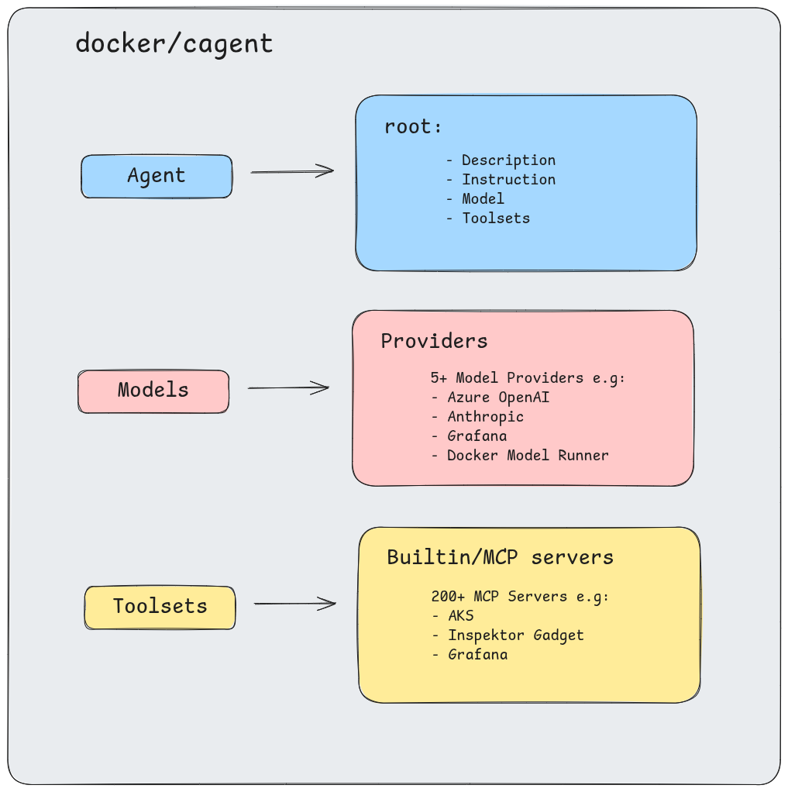

# Gadget Agent

A collection of AI agents designed to help troubleshoot Container/Kubernetes issues using [cagent](https://github.com/docker/cagent)

## Getting Started

Start by setting up a workspace for agent definition:

```bash
mkdir gagent-agents
cd gagent-agents
```

Fetch the gadget definition:

```bash
cagent pull smqasims/agent-on_call
```

You will need to change a few things in the agent definition. For example:

```
$ cat smqasims_agent-on_call.yaml | grep "TODO" -A 2
    ## TODO: Replace with your Azure OpenAI deployment name
    model: gpt-4-1
    # TODO: Replace with your Azure OpenAI base URL
    base_url: https://your-project-resource.cognitiveservices.azure.com
    provider_opts:
--
          # TODO: Replace with the path to your kubeconfig file
          kubeconfig: PATH_TO_YOUR_KUBECONFIG 
          ## TODO: Replace with the path to your Azure CLI config directory
          azure_dir: PATH_TO_YOUR_AZURE_CONFIG_DIR
          ## TODO: Replace with your Container User ID
          container_user: "1000"
          access_level: readwrite
--
        ## TODO: You will need to set GRAFANA_API_KEY in the shell environment where the agent is running
        config:
          ## TODO: Replace with your Grafana instance URL
          url: http://127.0.0.1:3000

```

> Note: You can also use other LLM providers like OpenAI, Anthropic, etc

Run the agent:

```bash
export AZURE_API_KEY=your_azure_openai_key
export GRAFANA_API_KEY=your_grafana_api_key
cagent run ./smqasims_agent-on_call.yaml
```


> Note: You can also push preconfigured agents to a registry and run it directly using `cagent run <your-registry>/your-agent:tag`

## Agents

Currently, the following agents are available:

- **[on_call](agents/on_call.yaml)**: An agent designed to assist on-call engineers in diagnosing and resolving issues within containerized applications and Kubernetes clusters. It leverages various tools and APIs to gather information, analyze problems, and suggest solutions.
- **[gadget_assistant](agents/gadget_assistant.yaml)**: An AI assistant that helps users with selecting Inspektor Gadget gadget based on the provided use cases and running them in their Kubernetes environment. 
- **[application_connectivity](agents/application_connectivity.yaml)**: An AI assistant to check connectivity issues between pods in a Kubernetes cluster.

### Concepts



There are three main concepts in the agents:

1. **Instructions**: These are high-level guidelines that define the agent's overall purpose and behavior. They provide context and set the tone for how the agent should respond to user queries.
2. **Models**: These define LLM providers and configurations that the agent will use to process natural language input and generate responses e.g Azure OpenAI, OpenAI, Anthropic etc.
3. **Toolsets**: These are collections of tools that the agent can use to perform specific tasks. Each toolset is designed to handle a particular aspect of the agent's functionality, such as interacting with Kubernetes, querying Grafana, or accessing cloud provider APIs. You have option for built-in toolsets or [MCP toolsets](https://hub.docker.com/mcp/explore?search=gadget).

See, [usage](https://github.com/docker/cagent/blob/main/docs/USAGE.md#tool-configuration) for more details on configuring models and toolsets.